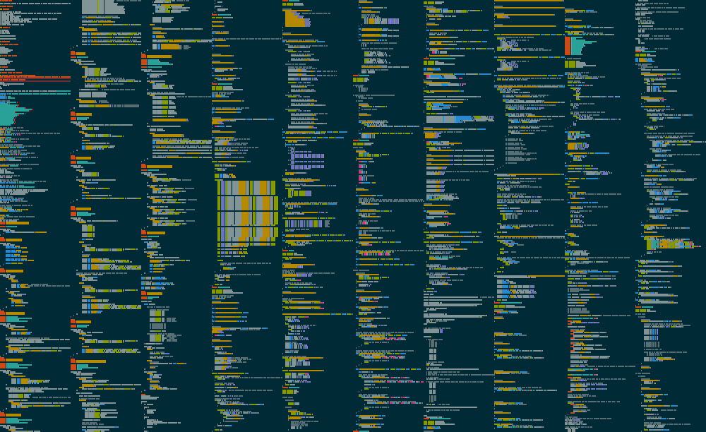

# codevis

**codevis** takes all source code / UTF-8 encodable files in a folder and renders them to one image, syntax highlighting any file it knows how to. These images show the shape and size of files, but not the exact characters inside the files. Looking for a video instead of an image? Check out this repo's sister project [codemov](https://github.com/sloganking/codemov)

## Renders

This repo's render of [sloganking/My-Own-OS](https://github.com/sloganking/My-Own-OS/tree/6e555c05ce46dcc13904eb41cc4b3ccde61032b5):

A readable render of this repo. Zoom in to see the text!

Exact command used: `codevis -i ./ -o /home/username/Pictures/output.png --bg-pixel-color style-checkerboard-darken --readable --line-nums --show-filenames`

## CLI Installation

- Install [the Rust programming language.](https://www.rust-lang.org/)
- Run `cargo install codevis`
- You may have to add cargo's binary installation folder (`/home/username/.cargo/bin/` on Linux) to your system's path, if it is not there already.

## CLI Usage

To visualize all files in the current directory and subdirectories. Run `codevis -i ./`. This will store the visualization in a new file called `./output.png`. If you wish to generate an output file with a different name, You can use the `-o` flag like so `codevis -i ./ -o ./different_name.png`.

For a list of more commands run `codevis --help`.
